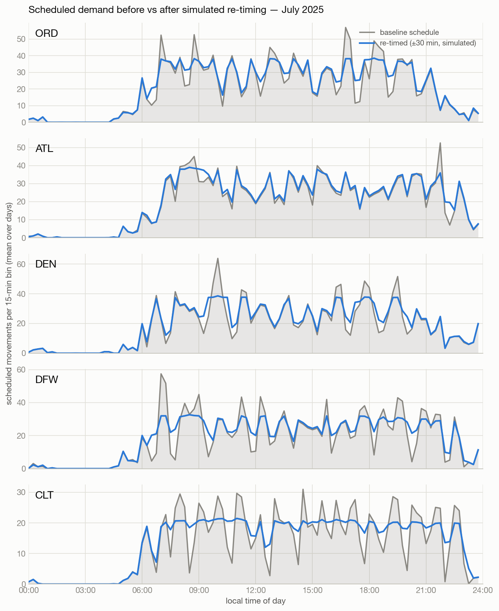
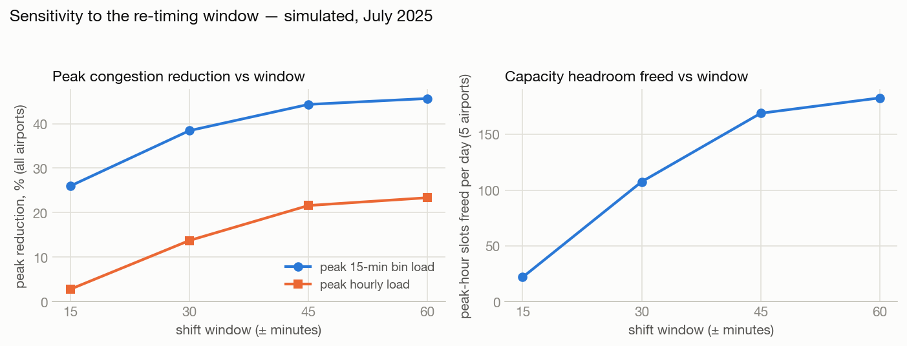

# Flight schedule smoothing — a simulation study on historical BTS data

**Question.** If scheduled departure times at busy US airports were allowed to
shift within a small window (±15–60 minutes), how much lower could peak-period
congestion be — without adding, removing, or cancelling a single flight — and
how much capacity headroom would that free at the peak?

**Answer style.** Everything here is a *simulated re-timing of historical
schedules under stated assumptions*. This study does not model real airspace,
weather, gates, crews, or passengers, and it makes **no operational or safety
claims** of any kind. See [Limitations](#limitations).

Results site: `docs/index.html` (GitHub Pages).
All numbers: [`results/summary.json`](results/summary.json).

## Results (July 2025, ±30-min window — simulated)

Airports: **ORD, ATL, DEN, DFW, CLT** — the 5 busiest
in the US by 2025 scheduled movements; July was the busiest month at
those airports (279,750 scheduled movements).

- **Peak 15-min bin load: −38.43%** (mean daily peak, summed across airports)
- **Peak rolling-hour load: −13.75%**
- **Slots freed: 107.5 movements/day** of new headroom in the formerly busiest hours (sum over the five airports)

| Airport | Peak 15-min (before → after) | Δ | Peak hour (before → after) | Δ | Slots freed / day | p95 hourly proxy |
|---|---|---|---|---|---|---|
| ORD | 60 → 39.2 | −34.66% | 173.2 → 154 | −11.08% | 19.2 | 158 |
| ATL | 59.3 → 39 | −34.13% | 171.7 → 153.7 | −10.46% | 18 | 150 |
| DEN | 66.4 → 38.7 | −41.66% | 181 → 151.8 | −16.13% | 29.2 | 154 |
| DFW | 59.6 → 33 | −44.7% | 158.8 → 129.1 | −18.69% | 29.7 | 143 |
| CLT | 33.5 → 21.7 | −35.26% | 97 → 85.5 | −11.84% | 11.5 | 93 |

Peak loads are means of daily maxima. All values are simulated re-timings of
historical schedules — see Limitations.

### Sensitivity to the shift window

| Window | Flights shifted | Peak 15-min bin | Peak hour | Slots freed / day (total) |
|---|---|---|---|---|
| ±15 min | 7,846 | −26.0% | −2.81% | 21.9 |
| ±30 min | 21,262 | −38.43% | −13.75% | 107.5 |
| ±45 min | 30,664 | −44.32% | −21.61% | 168.9 |
| ±60 min | 33,270 | −45.65% | −23.36% | 182.7 |





## Data

- **Source:** Bureau of Transportation Statistics, *Marketing Carrier On-Time
  Performance* (https://www.transtats.bts.gov/ots/), monthly prezipped CSVs.
  US government work, public domain — which is why a derived per-flight subset
  can be committed in `data/derived/` for reproducibility.
- **Fields used** (verified against the actual 2025 header, not assumed):
  `FlightDate`, `CRSDepTime`, `CRSArrTime`, `Origin`, `Dest`,
  `Marketing_Airline_Network`, `Flight_Number_Marketing_Airline`,
  `Tail_Number`, `Cancelled`. The raw header spells one column
  `"Operating_Airline "` with a trailing space; headers are
  whitespace-normalized on load.
- **Scheduled times, not actuals.** The study re-times schedules; delay
  behavior is out of scope.
- Cancelled flights are dropped; duplicate records (same tail, airport,
  date, and scheduled minute) are dropped and counted in the log.

## Scope

- The **busiest airports by scheduled movements** (departures + arrivals)
  across the full year, and within them the **busiest single month** — chosen
  by the same movement count, stated in the results section. One busy month is
  enough to expose daily peak structure; a national network model is
  explicitly not attempted.
- **Flight count is fixed.** No flights are added, removed, or cancelled —
  only scheduled times shift.

## Method

1. **Bin demand.** Count scheduled movements per airport per 15-minute bin
   per service day. Times are local to each airport (congestion is a
   local-clock phenomenon; time series are never merged across airports).
   If a scheduled arrival is earlier than its departure, the arrival is
   assigned to the next day (safe for US domestic block times).
2. **Capacity proxy (assumption, not fact).** No published runway capacity is
   used. The practical ceiling for each airport is defined as the **95th
   percentile of observed rolling-hour movement counts** in the baseline
   month. This is an empirical stand-in and is listed in Limitations.
3. **Re-timing heuristic.** Each flight may shift its entire schedule
   (departure and arrival together; block time unchanged) by a multiple of
   15 minutes within a configurable window (headline: ±30 min). A greedy
   pass repeatedly takes the fullest 15-minute bin at each airport-day and
   moves its most-movable flight into the least-loaded reachable bin. A move
   is accepted only if every bin that gains a movement stays strictly below
   its own airport-day's current maximum — so no peak can rise or silently
   migrate to another airport. Passes repeat until no improving move exists.
4. **Turnaround feasibility.** For consecutive legs flown by the same tail
   number, the re-timed ground time must be at least
   `min(original ground time, 30 minutes)` — an already-tight turn may not be
   made tighter, and every other turn keeps at least the configured minimum.
   Chains are built across **all** airports in the month, so a shift cannot
   squeeze a turnaround at an airport outside the study set. Flights with no
   tail number, and legs with corrupt overlapping times, are never shifted.
5. **Departures never cross midnight**, so each flight keeps its service date
   (this keeps daily comparisons well-defined; arrivals may roll past
   midnight, e.g. 23:50 shifted +15).

### Metric definitions (exact arithmetic)

- **15-min bin load** — scheduled movements at one airport in one 15-minute
  bin of one day. **Hourly load** — rolling sum of 4 consecutive bins within
  a day (stricter than clock hours).
- **Peak congestion reduction (%)** — drop in the mean-over-days daily
  maximum load, before vs after, reported for both bin and hourly loads.
  The overall figure compares the sums of per-airport mean daily maxima.
- **Slots freed (per airport per day)** = `max hourly load before − max
  hourly load after`. Rationale: re-timing conserves the number of flights,
  so summed over any full day, headroom below a fixed ceiling is *conserved*
  — the only genuine capacity change is **at the peak**. This metric counts
  additional movements schedulable in the formerly busiest hour without
  exceeding the load the airport demonstrably handled at baseline. We
  deliberately do not sum headroom across off-peak hours; that number is
  large, unchanged by re-timing, and would be misleading.
- **Congested hour-windows** — count of rolling-hour windows at or above the
  95th-percentile capacity proxy, before vs after (secondary indicator).

## Reproduce it

```bash
python3 -m pip install -r requirements.txt
python3 src/fetch_data.py          # ~360 MB: 12 monthly zips from BTS
python3 src/prepare.py             # select airports/month, clean, bin
python3 src/metrics.py             # optimize at ±15/30/45/60, write summary.json
python3 src/charts.py              # figures -> results/figures + docs/figures
python3 -m pytest tests/ -q        # sanity assertions on the saved outputs
```

`src/config.py` holds every knob (window, step, turnaround minimum, bin
width, capacity percentile, year). The pipeline prints movement counts and
selection evidence as it runs; `python3 src/prepare.py --reuse-selection`
skips the 12-month scan on re-runs.

To skip the raw download entirely, the committed derived subset in
`data/derived/` is sufficient to run `metrics.py`, `charts.py`, and the
tests for the selected month.

## Sanity checks

`tests/test_sanity.py` re-verifies, from the saved artifacts (not the
optimizer's in-memory state): flight count unchanged; every shift within its
window and on the 15-minute grid; no departure crossed midnight; every
tail-number turnaround ≥ its minimum; per-airport movement totals and
per-day departure counts conserved; and no airport-day peak higher than
baseline. The optimizer also asserts all of this at the end of every run and
fails loudly if any check breaks.

## Limitations

Genuinely load-bearing caveats, not fine print:

- **The capacity proxy is an assumption.** The 95th percentile of observed
  hourly movements is not a runway capacity rating. It reflects what was
  scheduled and flown, under the weather/configuration/demand of that month.
  Real declared capacity varies by runway configuration and conditions.
- **No airspace, weather, gate, crew, or passenger-connection modeling.**
  A shift that is feasible for the aircraft may be infeasible for a crew
  duty-time limit, a gate conflict, a bank of connecting passengers, or an
  en-route flow restriction. None of that is modeled.
- **Turnaround feasibility is tail-number-only** and uses a single global
  30-minute minimum; real minimum turn times vary by aircraft type, carrier,
  and airport.
- **The greedy heuristic has no optimality guarantee.** Reported reductions
  are a lower bound on what an exact optimizer could achieve *within this
  model*, not an operational plan.
- **Hourly peaks compress far less than 15-minute peaks.** A small window
  flattens spikes but cannot drain an hour-wide plateau; both numbers are
  reported and the difference is real, not an artifact to hide.
- **Historical schedules.** One month of one year at a handful of airports;
  current schedules and demand differ.
- **Airline banking is ignored on purpose.** Hub schedules bank flights
  deliberately to create connections; smoothing the banks has a commercial
  cost this study does not price.
- Month-boundary edge: red-eye arrivals into day 1 (from the prior month)
  and out of the last day are not visible to the metrics; both sit in
  near-empty overnight bins and do not affect daytime peaks.

## Motivation context (not findings)

Peak-period congestion at hub airports concentrates controller workload and
drives delay propagation; the FAA manages it operationally through demand-
management programs (e.g. slot administration at capacity-constrained
airports, 14 CFR Part 93) and Ground Delay Programs. See e.g. FAA,
*Airport Capacity Profiles* (2014–2023 updates), and Ball et al., *Total
Delay Impact Study* (NEXTOR, 2010) on the cost of US flight delay. These
citations motivate why schedule timing matters; **nothing in this repository
measures workload, delay, or safety.**

## License / data

Code: MIT. Data: BTS on-time performance data is a US government work
(public domain); the committed derived subset retains no fields beyond the
schedule columns listed above.
